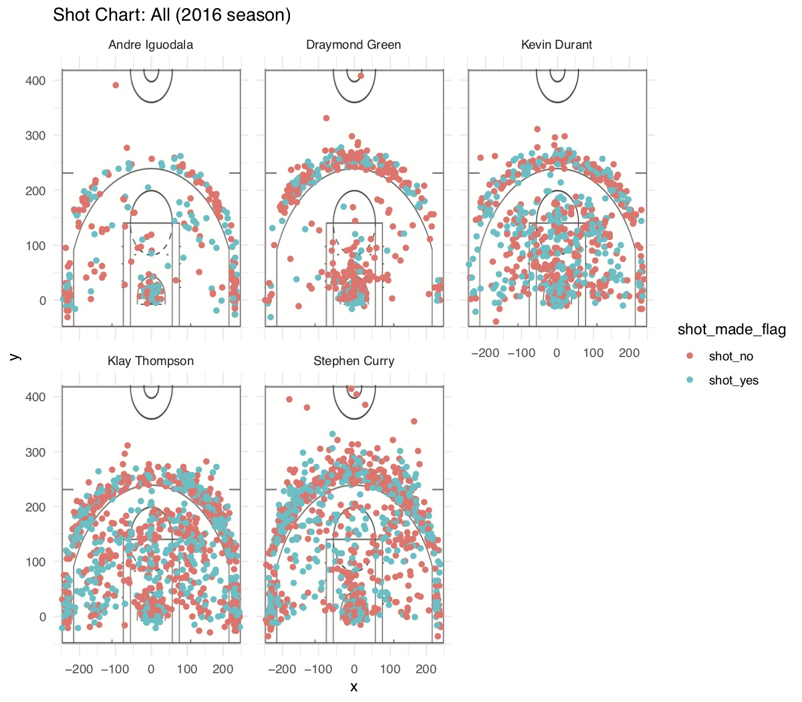
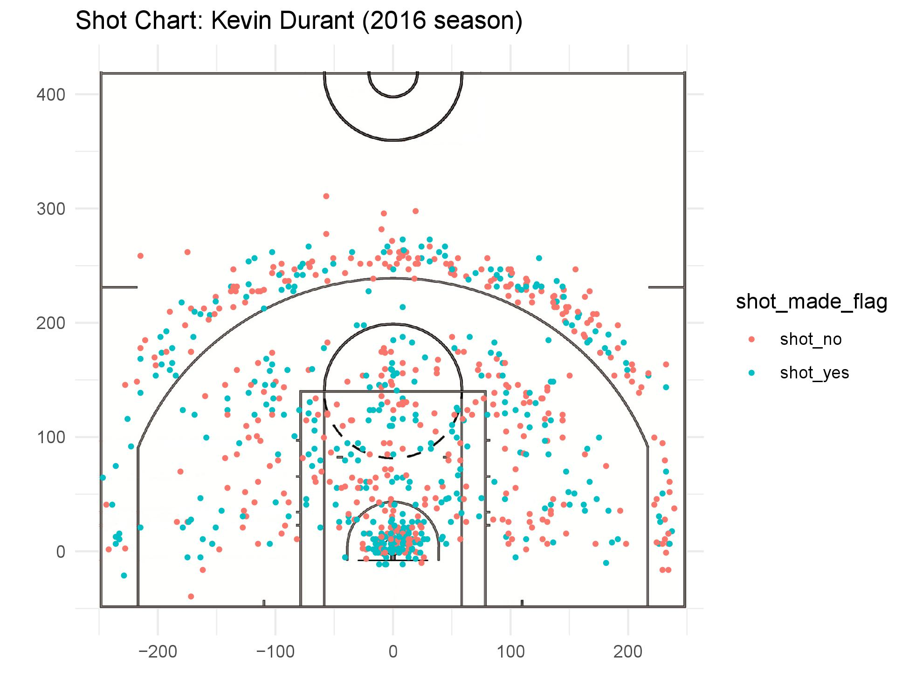

report1
================
Melissa Ly

5.1) Effective Shooting Percentage
----------------------------------

    ## Warning: package 'dplyr' was built under R version 3.4.4

    ## # A tibble: 5 x 4
    ##   name           total  made perc_made
    ##   <fct>          <int> <int>     <dbl>
    ## 1 Kevin Durant     915   495     0.541
    ## 2 Andre Iguodala   371   192     0.518
    ## 3 Klay Thompson   1220   575     0.471
    ## 4 Stephen Curry   1250   584     0.467
    ## 5 Draymond Green   578   245     0.424

5.2) Narrative
--------------

Warriors Sweep at Roaracle Arena!
---------------------------------

**The Golden State Warriors** were able to make the Bay Area proud once again. The 2016 season proved to be a triumphant one with a record number of 67 wins and only 15 losses. Our Golden State Warriors finished 1st in NBA Western Conference and were able to claim the championship trophy to bring back to the Bay. The star players that brought the team to victory were none other than Andre Iguodala, Klay Thompson, Kevin Durant, Draymond Green and Stephen Curry. Each of these players gave it their all and came out on top. This report will show why these star players deserved every bit of recognition for the 2016 season.

### Motivation

The 2015-2016 season got the ball rolling for the Warriors as they headed for another championship win in the 2016-2017 season. The Warriors were definitely eager to keep the trophy as they headed into the 2016-2017 season and this definitely showed as they gave their all in each game.

### Background

During the 2016-2017 season, the Warriors were joined by star player Kevin Durant and afterwards a slew of awe and blacklash followed. Durant is known as an MVP player in all corners of the NBA and holds his own torch to fellow star players Stephen Curry and Klay Thompson. Durant joining the Warriors was like adding gold to diamonds and some people found this to be unfair as the 2016-2017 season progressed. The electricity between these 3 players were shown on and off the court as they won the championship trophy. But speculators want to know if Durant actually held his own or just piggybacked off Steph and Klay? We will later use some data to see whether Durant was able to keep up his own weight and help the Warriors succeed.

### Data

We compiled statistics on these 5 players and here are some stats shown below:

``` r
points2
```

    ## # A tibble: 5 x 4
    ##   name           total  made perc_made
    ##   <fct>          <int> <int>     <dbl>
    ## 1 Andre Iguodala   210   134     0.638
    ## 2 Kevin Durant     643   390     0.607
    ## 3 Stephen Curry    563   304     0.540
    ## 4 Klay Thompson    640   329     0.514
    ## 5 Draymond Green   346   171     0.494

``` r
points3
```

    ## # A tibble: 5 x 4
    ##   name           total  made perc_made
    ##   <fct>          <int> <int>     <dbl>
    ## 1 Klay Thompson    580   246     0.424
    ## 2 Stephen Curry    687   280     0.408
    ## 3 Kevin Durant     272   105     0.386
    ## 4 Andre Iguodala   161    58     0.360
    ## 5 Draymond Green   232    74     0.319

``` r
overall
```

    ## # A tibble: 5 x 4
    ##   name           total  made perc_made
    ##   <fct>          <int> <int>     <dbl>
    ## 1 Kevin Durant     915   495     0.541
    ## 2 Andre Iguodala   371   192     0.518
    ## 3 Klay Thompson   1220   575     0.471
    ## 4 Stephen Curry   1250   584     0.467
    ## 5 Draymond Green   578   245     0.424

Each of these tables have 4 columns detailing the player's name, total shots taken, number of shots made, and perentage of total shots made

-   name: the name of the player.
-   total: the total number of shots taken by each player.
-   made: the number of shots made by each player.
-   perc\_made: the percentage of total shots made by each player.

Points2 table is the Effective Shooting Percentage for 2 Point Field Goals for each player Points3 table is the Effective Shooting Percentage for 3 Point Field Goals for each player Overall table is the Effective Shooting Percentage for all types of Field Goals for each player.

### Analysis

After analyzing these tables we can see how amazing each player is. All 5 players were able to have a 2 pointer shooting percent above 49%. We also see that Kevin Durant really does hold his own weight against Steph and Klay by having over a 60% 2 pointer shooting ability compared to Steph's 54.0% and Klay's 51.4% 2 pointer shooting percentages.

Through the 3 pointer table we also see how each player fairs against the other in making their 3-pointers. Having a 35% 3-point shooting score is considered very good whereas a 40% 3-point shooting score is considered great and we see that Klay, Steph, Kevin, and Andre are all within the very good margin which is still outstanding.

The overall shooting percentages for all types of field goals also shows that each player is making over 42% of their shots and this is considered elite in the NBA as well.

### Discussion



Through this visual we can see each player's shot chart for the 2016 season. The legend shows us the number of shots attempted and made. From the chart, we see that Steph, Klay, and Kevin have taken a large amount of shots and Kevin has the highest percentage of these shots made (54%). Even though Kevin has the most amount of shots made, Klay and Steph have both attempted a total of 1220 and 1250 shots and compared to Kevin's total of 915 we see a noticable difference of around ~300 shots.

### Conclusions



We prove through our analysis that the Warriors definitely have an all-star lineup and each player definitely does contribute some amazing ability to the table. Kevin Durant especially has shown his colors by proving to be an amazing player who deserves to be on the team and holds his own weight.

### References

Utilized basketball-reference.com for viewing the Warriors roster and stats for added information.
